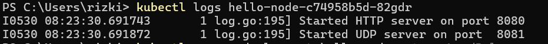
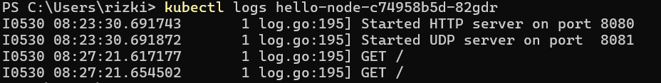
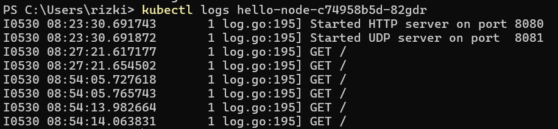
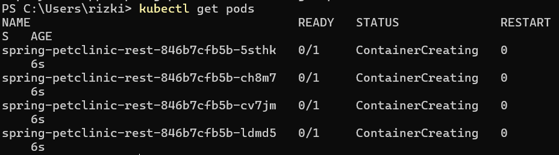

# module11

## Reflection on Hello Minikube
1. Before exposed  
      
    After exposed  
      
    After several run  
      
    Sebelum exposed, logs hanya menampilkan informasi bahwa service telah berjalan pada port yang diberikan. Setelah exposed dan dijalankan, logs menampilkan informasi tambahan bahwa service menerima request GET. Setelah dijalankan berkali-kali, logs mendapat tambahan informasi request GET setiap kali service dijalankan.  

2. `-n` digunakan untuk menentukan namespace tempat perintah dijalankan. Jika tidak ditulis, maka namespace = default. Pada pemanggilan dengan `-n kube-system`, perintah get tidak menampilkan service yang sudah saya buat karena service tersebut berada di namespace default sedangkan pemanggilan get ini untuk service yang berada di namespace `kube-system`.  

## Reflection on Rolling Update & Kubernetes Manifest File  
1. Rolling update akan mengganti pods yang lama secara bertahap. Selama proses update, beberapa pod baru akan dibuat sementara pod lama masih berjalan. Hal ini memastikan  tidak ada downtime selama proses update. Untuk Recreate deployment, semua pod lama akan diberhentikan terlebih dahulu lalu pod baru dibuat. Hal ini bisa menyebabkan downtime tapi memastikan proses restart yang lebih bersih.  

2. Untuk mencoba deployment dengan Recreate, saya menggunakan perintah `kubectl edit deployment spring-petclinic-rest` agar bisa mengedit file deployment.  
1  
Setelah itu saya set image kembali ke 3.0.2 untuk melihat proses update. Setelah set image, proses update berjalan seperti ini  
  
  
Terlihat bahwa semua pods dibuat kembali dan tidak pods lama yang berjalan  

3. Saya menjalankan `kubectl get deployments/spring-petclinic-rest -o yaml > deployment.yaml` lagi untuk mendapatkan file yaml kemudian saya rename menjadi `deployment-recreate.yaml` pada repo ini untuk membedakan dengan file yaml sebelumnya.  

4. manifest file memungkinkan proses deplyment yang lebih cepat dengan adanya otomasi. Tanpa manifest file, kita harus mengetik banyak sekali command untuk melakukan deploy dan membuat service. Manifest file juga memastikan konsistensi dari aplikasi yang dideploy dengan menggunakan konfigurasi dan versi yang sama setiap kali deploy.